# OmniFantasy — System Architecture

Rendered best in GitHub or any Mermaid-compatible viewer (e.g. VS Code with the Markdown Preview Mermaid Support extension).

```mermaid
graph TB
    %% ── External triggers ────────────────────────────────────────────────────
    Dev([Developer\npushes code]) -->|git push| GitHub

    subgraph Hosting ["☁️ Hosting"]
        GitHub[GitHub\nSource Control] -->|auto-deploy| Vercel[Vercel CDN\nomnifantasy.vercel.app]
    end

    Vercel -->|serves React bundle| Browser

    %% ── Frontend ─────────────────────────────────────────────────────────────
    subgraph Frontend ["⚛️ Frontend — React 18 + Vite (runs in browser)"]
        Browser([User Browser])

        subgraph Orchestrator ["omnifantasy-app.jsx — Main Orchestrator"]
            AppState[Global State\ncurrentView · selectedLeagueId\ndraftOrderSettings · timeRemaining]
        end

        subgraph UIViews ["Views"]
            HomeV[Home View\nleague cards · invite actions\nYour Turn indicators]
            LeagueV[LeagueView.jsx\nMy Roster · Standings\nBig Board · Draft Results]
            DraftV[DraftView.jsx\nlive draft grid · EP display\nqueue panel · timer]
        end

        subgraph HooksLayer ["Custom Hooks"]
            useAuth[useAuth\nsupabase auth state]
            useLeagues[useLeagues\nleague CRUD]
            useDraft[useDraft\npicks · draft_state]
            useEP[useExpectedPoints\nEP per sport]
            useResults[useResults\nfinal sport results]
            useQueue[useDraftQueue\npersonal queue + settings]
            useChat[useChatMessages\nleague chat]
            useAutoP[useAutoPickLogic\ntimer expiry + queue autopick]
        end

        subgraph UtilsLayer ["Utilities & Config"]
            draftUtil[draft.js\npicker index · snake logic]
            pointsUtil[points.js\ncalculatePickPoints\ngetPartialMultiEventPoints]
            standUtil[standings.js\ngenerateStandings]
            aliasUtil[aliases.js\nteam name normalization]
            sportsConfig[sports.js\nTEAM_POOLS · AVAILABLE_SPORTS\nEP_DRIVEN_POOL_SPORTS]
        end

        subgraph DataFetch ["Data Fetchers (called by hooks)"]
            supabaseClient[supabaseClient.js\nall DB read/write ops]
            oddsApi[oddsApi.js\nThe Odds API wrapper\nEP calculation]
            oddsScraper[oddsScraper.js\nF1 · ATP · WTA\nnon-Odds-API sports]
            resultsApi[resultsApi.js\nESPN + Jolpica results\ncache management]
        end

        Browser --> Orchestrator
        Orchestrator --> UIViews
        Orchestrator --> HooksLayer
        HooksLayer --> DataFetch
        UIViews --> UtilsLayer
        HooksLayer --> UtilsLayer
    end

    %% ── Supabase ─────────────────────────────────────────────────────────────
    subgraph SupabaseCloud ["🗄️ Supabase (Backend-as-a-Service)"]

        SupaAuth[Supabase Auth\nemail+password\nuser_metadata storage]

        subgraph DB ["PostgreSQL Database"]
            leagues[(leagues\ndraft settings · timer · emoji)]
            members[(league_members\nstatus · name · position)]
            picks[(draft_picks\npick_number · sport · team)]
            draftState[(draft_state\ncurrent_pick · draft_order\npick_started_at)]
            oddsCache[(odds_cache\nEP data · updated_at\ncache version)]
            sportResults[(sport_results\nchampion · runner_up\nrankings · is_complete)]
            queueTable[(draft_queue\nuser pick wishlist)]
            memberSettings[(draft_member_settings\nauto_pick_from_queue)]
            epHistory[(ep_history\nEP snapshots over time\nfor trend charts)]
            chatTable[(league_chat\nmessages · timestamps)]
            remindersTable[(draft_reminders\n1h reminder dedup)]
        end

        Realtime[Supabase Realtime\nWebSocket pub/sub]

        subgraph EdgeFunctions ["Edge Functions (Deno)"]
            otcFn[send-otc-email\nnotify next picker\nafter every pick]
            reminderFn[check-timer-reminders\n1h warning emails\ncron job]
            inviteFn[send-league-invite\nnew member emails]
            sharedHelpers[_shared/draft-helpers.ts\ngetPickerIndex · computeTimeRemaining\ncomputeDeadline · sendEmail]
        end

        pgCron[pg_cron\nevery 15 minutes]
    end

    %% ── External APIs ────────────────────────────────────────────────────────
    subgraph ExternalAPIs ["🌐 External APIs"]
        OddsAPIExt[The Odds API\nchampionship futures odds\n~165 credits/month]
        ESPNApi[ESPN API\ntournament brackets\nteam results]
        JolpicaApi[Jolpica API\nF1 season standings\nfree · no key needed]
    end

    %% ── Email ────────────────────────────────────────────────────────────────
    subgraph EmailInfra ["📧 Email"]
        SMTP[Gmail SMTP\nsmtp.gmail.com:587]
    end

    %% ══ Data flow edges ═══════════════════════════════════════════════════════

    %% Auth
    useAuth <-->|sign in · sign up · sign out| SupaAuth
    SupaAuth -->|user + user_metadata| useAuth

    %% DB reads/writes via supabaseClient
    supabaseClient <-->|leagues CRUD| leagues
    supabaseClient <-->|members CRUD| members
    supabaseClient <-->|picks INSERT/SELECT| picks
    supabaseClient <-->|draft_state READ/UPDATE| draftState
    supabaseClient <-->|queue CRUD| queueTable
    supabaseClient <-->|settings CRUD| memberSettings
    supabaseClient <-->|chat INSERT/SELECT| chatTable

    %% Realtime subscriptions
    picks -->|INSERT events| Realtime
    draftState -->|UPDATE events| Realtime
    chatTable -->|INSERT events| Realtime
    Realtime -->|new pick · state change| useDraft
    Realtime -->|new messages| useChat

    %% EP data flow
    useEP -->|check cache freshness| oddsCache
    oddsCache -->|stale or miss| oddsApi
    oddsApi -->|fetch championship odds| OddsAPIExt
    oddsApi -->|write updated cache| oddsCache
    oddsApi -->|snapshot EP values| epHistory
    oddsScraper -->|F1 live standings| JolpicaApi
    oddsScraper -->|write cache| oddsCache
    useEP --> oddsApi
    useEP --> oddsScraper

    %% Results data flow
    useResults -->|check cache freshness| sportResults
    sportResults -->|stale or miss| resultsApi
    resultsApi -->|brackets · standings| ESPNApi
    resultsApi -->|F1 final standings| JolpicaApi
    resultsApi -->|write updated cache| sportResults

    %% Email flows
    Orchestrator -->|after each pick\n1.5s delay| otcFn
    Orchestrator -->|on league create| inviteFn
    pgCron -->|every 15 min| reminderFn
    otcFn --> sharedHelpers
    reminderFn --> sharedHelpers
    inviteFn --> sharedHelpers
    otcFn -->|reads current picker| draftState
    otcFn -->|reads timer settings| leagues
    reminderFn -->|reads active leagues| leagues
    reminderFn -->|reads pick state| draftState
    reminderFn -->|dedup check + write| remindersTable
    sharedHelpers -->|SMTP send| SMTP
    SMTP -->|delivers to| Recipients([League Members\ninboxes])
```

---

## Key Data Flows (plain English)

### 1 — Page Load
User opens app → Vercel serves the React bundle → `useAuth` checks Supabase session → if logged in, `useLeagues` fetches leagues → URL `?draft=<id>` param handled → navigate to correct view.

### 2 — Expected Points (EP)
`useExpectedPoints` → `oddsApi.js` checks `odds_cache` table → if fresh (<2 days, version matches): return cached data → if stale: fetch from **The Odds API** (standard sports) or **Jolpica** (F1) via `oddsScraper.js` → normalize team names via `aliases.js` → write back to `odds_cache` → snapshot current EP values to `ep_history` for trend charts.

### 3 — Making a Pick
User confirms pick → `supabaseClient.makePick()` → INSERT into `draft_picks` + UPDATE `draft_state` → Supabase Realtime broadcasts the changes → **all connected clients** receive the update in real-time → 1.5s later, client calls `send-otc-email` Edge Function → reads new `draft_state` to find next picker → sends email via Gmail SMTP.

### 4 — Auto-Pick
`useAutoPickLogic` monitors `timeRemaining` (computed from `draft_state.pick_started_at`) → when timer expires OR picker's queue item is available → calls `makePick()` automatically → same email flow as manual pick.

### 5 — Results & Standings
`useResults` → `resultsApi.js` checks `sport_results` cache → if stale: fetch from **ESPN** (brackets/results) or **Jolpica** (F1) → normalize names → write cache → `calculatePickPoints()` maps results to Omnifantasy 80/50/30/20 points → `generateStandings()` sorts members by total points.

### 6 — 1-Hour Reminder
`pg_cron` fires `check-timer-reminders` every 15 min → for each active timed league: `computeTimeRemaining()` (pause-aware) → if 60–76 min remaining: check `draft_reminders` for dedup → send email via SMTP → record in `draft_reminders`.

---

## Component Dependency Summary

| Layer | Tech | Talks To |
|---|---|---|
| CDN / Hosting | Vercel | GitHub (deploy trigger) |
| Frontend | React 18 + Vite + TailwindCSS | Supabase JS SDK, external APIs |
| Auth | Supabase Auth | Frontend hooks |
| Database | PostgreSQL (Supabase) | Frontend via supabaseClient.js, Edge Functions |
| Realtime | Supabase Realtime (WebSocket) | Frontend hooks (useDraft, useChat) |
| Edge Functions | Deno (Supabase) | PostgreSQL, Gmail SMTP |
| Scheduled Jobs | pg_cron (Supabase) | Edge Functions |
| Odds Data | The Odds API | oddsApi.js → odds_cache |
| Results Data | ESPN API + Jolpica API | resultsApi.js → sport_results |
| Email Delivery | Gmail SMTP | Edge Functions |
