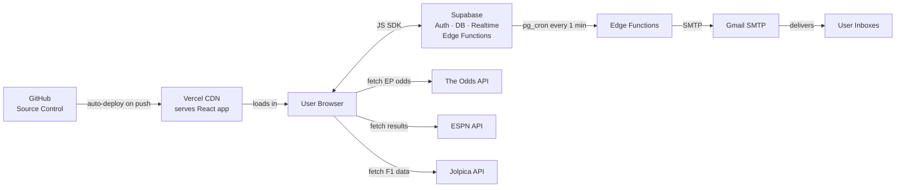
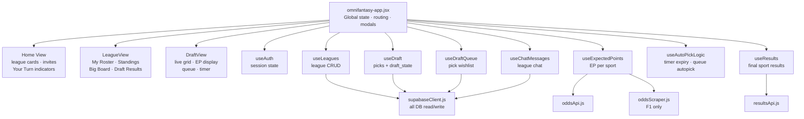
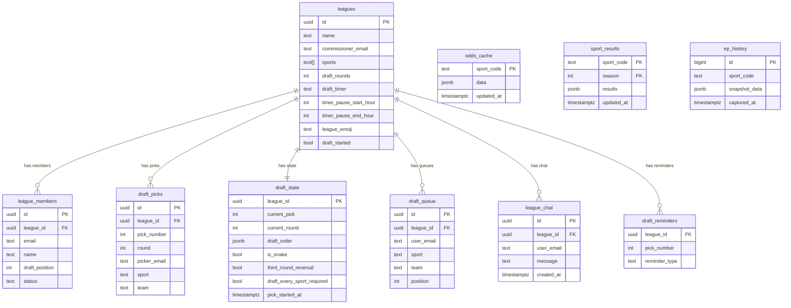
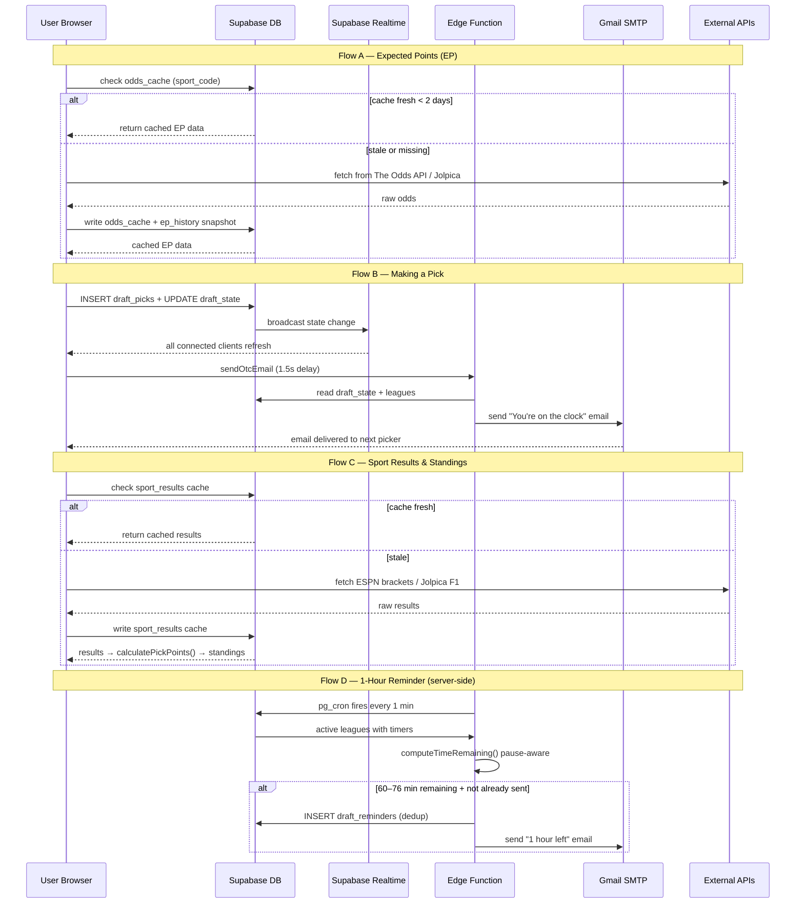

# OmniFantasy — System Architecture

Four focused diagrams, each covering a specific concern. Rendered natively on GitHub.

---

## 1 · Infrastructure Overview

Who talks to whom at the service level.

---

## 2 · Frontend Layer

How the React app is structured internally.

---

## 3 · Database Schema

Tables and their relationships.

---

## 4 · Key Data Flows

The four main runtime flows end-to-end.

